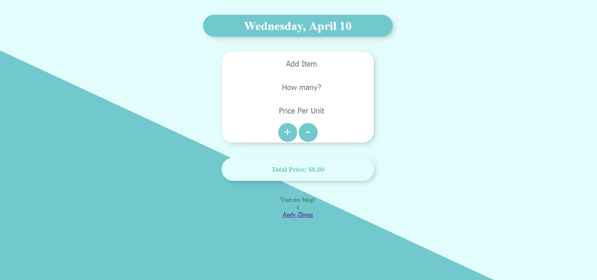

# Introduction
This is a shopping list web application that keeps a record of what the user wants to buy. Never forget what you want to buy again! This application is written in Node.js and stores all information in a cloud database, so users may access their list anywhere internet is present. Access it at: https://andyshoppinglist.herokuapp.com/
  
## Config
This application is written primarily in Node.js with the following dependencies: body-parser, ejs, express, mongoose, serve-favicon. So to get these packages, run the following in the terminal:  
```npm install body-parser ejs express mongoose serve-favicon```
  
## Functionality
The application:


Users may enter item into the list:

